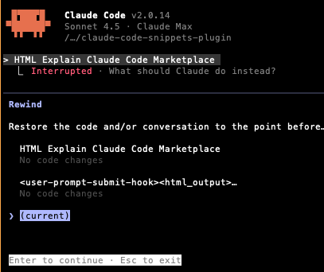

# Claude Code Snippets Plugin

A Claude Code plugin that automatically injects context snippets into your prompts using regex pattern matching anywhere in your input, from any file!

It has been tremendously helpful for me to provide different context to my agents in a composable way. I hope it is also helpful for you :).

## Installation

To install, you first have to install the `WarrenZhu050413/Warren-Claude-Code-Plugin-Marketplace` from github, and then install the `claude-code-snippets-plugin` from the marketplace. This can be installed through the `/plugins` command in Claude Code.

### Step 1: Add the Marketplace


*Add the Warren Claude Code Plugin Marketplace using `/plugin marketplace add WarrenZhu050413/Warren-Claude-Code-Plugin-Marketplace`*

### Step 2: Install the Marketplace


*Confirm the marketplace installation*

### Step 3: Browse and Install the Snippets Plugin


*Browse available plugins and install the `claude-code-snippets-plugin`*

## Quick Start

Test out the prompt:

```
HTML Explain Claude Code Marketplace
```


*Testing the HTML snippet injection with a simple prompt*

Double click `esc` to see that there is <user-prompt-submit-hook><html_output>...


*The hook automatically injects HTML context when it detects the HTML keyword*

And Claude Code will create and open an HTML file in your browser explaining Claude Code Marketplace


*The resulting HTML file opened in browser with a beautifully formatted explanation*

### Creating Your First Custom Snippet

```bash
claude
# Then use the create-snippet command:
/claude-code-snippets:create-snippet Create the Batman snippet that describes how to speak like a batman and tells the agent to speak like batman

# Follow the prompts to:
# 1. Set pattern keywords (e.g., "docker, container, dockerfile")
# 2. Provide content (paste directly or load from file)
# 3. Automated tests run and display results
# 4. Full snippet content shown for verification
```


*Creating a custom Batman snippet that tells Claude to speak like Batman*


*The Batman snippet automatically activates and Claude responds in Batman's voice*

### Other Commands

Note that you have the [`delete-snippet`](commands/delete-snippet.md), [`update-snippet`](commands/update-snippet.md), and [`read-snippets`](commands/read-snippets.md) commands available to you. They do exactly what you think they do! See the [Available Commands](#available-commands) section below for more details.

## How does CC-Snippets Work?

This plugin uses a **hook** that listens to all your prompts and automatically injects relevant context when it detects certain keywords. For example:

- Type "Can you help me with HTML?" → Automatically injects HTML formatting guidelines
- Type "I need docker help" → Automatically injects your Docker cheat sheet
- Type "Check this search query" → Automatically injects search optimization tactics

The magic happens through **regex pattern matching anywhere in your prompt** - not just slash commands at the start!

## Advanced: Manual Configuration

The plugin uses a **layered configuration system** in `scripts/`:

- **config.json**: Minimal shared examples (2 snippets: HTML, nvim, TDD)
- **config.local.json**: **Example configuration with 20+ useful snippets** (committed as examples)

The fields of the configurations is self-explanatory. It uses regex for patterns. See the [`config.local.json`](scripts/config.local.json) for example configurations.

## Documentation

For complete documentation including configuration details, troubleshooting, and advanced usage, see:

- **[Complete Documentation](docs/DOCUMENTATION.md)** - Comprehensive guide with all details

Note: The documentation is generated by Claude 4.5 Sonnet.

## Support & Contributing

- **Issues**: Report bugs or request features via GitHub issues
- **Documentation**: Claude Code plugin docs at https://docs.claude.com/en/docs/claude-code/plugins.md
- **Custom snippets**: Share your useful snippets with the community!

## License

MIT License - Feel free to customize and extend!
