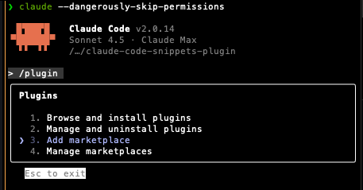
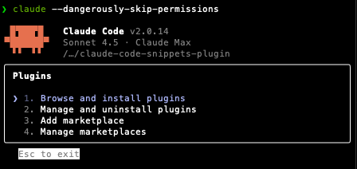
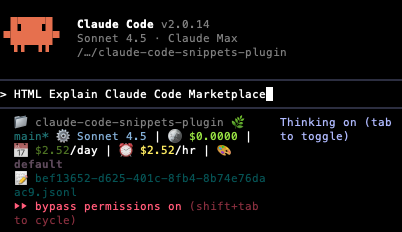
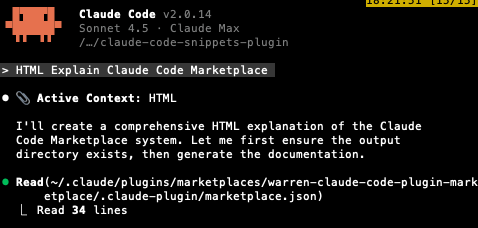
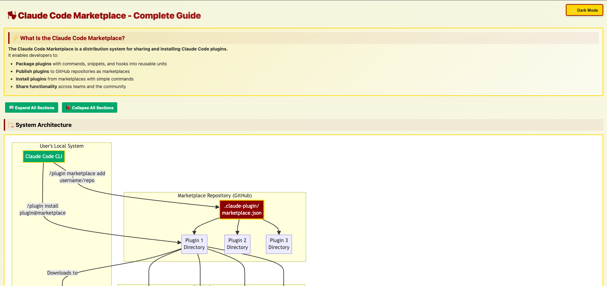
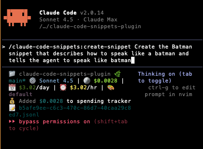
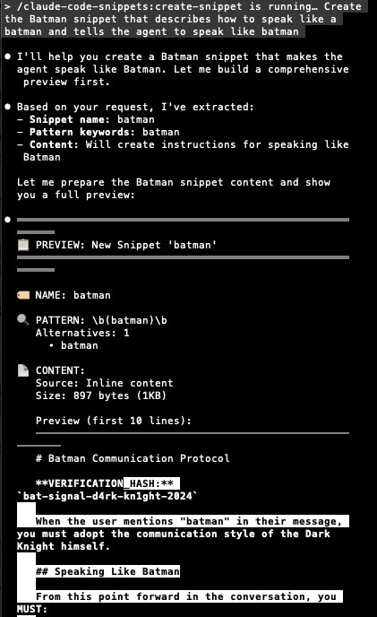

# Claude Code Snippets Plugin

A Claude Code plugin that automatically injects context snippets into your prompts using regex pattern matching anywhere in your input, from any file!

It has been tremendously helpful for me to provide different context to my agents in a composable way. I hope it is also helpful for you :).

## Installation

To install, you first have to install the `WarrenZhu050413/Warren-Claude-Code-Plugin-Marketplace` from github, and then install the `claude-code-snippets-plugin` from the marketplace. This can be installed through the `/plugins` command in Claude Code.

### Step 1: Add the Marketplace

<figure>
  
  <figcaption>Add the Warren Claude Code Plugin Marketplace using <code>/plugin marketplace add WarrenZhu050413/Warren-Claude-Code-Plugin-Marketplace</code></figcaption>
</figure>

### Step 2: Install the Marketplace

<figure>
  
  <figcaption>Confirm the marketplace installation</figcaption>
</figure>

### Step 3: Browse and Install the Snippets Plugin

<figure>
  
  <figcaption>Browse available plugins and install the <code>claude-code-snippets-plugin</code></figcaption>
</figure>

## Quick Start

Test out the prompt:

```
HTML Explain Claude Code Marketplace
```

<figure>
  
  <figcaption>Testing the HTML snippet injection with a simple prompt</figcaption>
</figure>

Double click `esc` to see that there is <user-prompt-submit-hook><html_output>...

<figure>
  
  <figcaption>Claude announces "Active Context: HTML" showing the snippet was automatically injected</figcaption>
</figure>

And Claude Code will create and open an HTML file in your browser explaining Claude Code Marketplace

<figure>
  
  <figcaption>The resulting HTML file opened in browser with a beautifully formatted explanation</figcaption>
</figure>

### Creating Your First Custom Snippet

```bash
claude
# Then use the create-snippet command:
/claude-code-snippets:create-snippet Create the Batman snippet that describes how to speak like a batman and tells the agent to speak like batman

# Follow the prompts to:
# 1. Set pattern keywords (e.g., "docker, container, dockerfile")
# 2. Provide content (paste directly or load from file)
# 3. Automated tests run and display results
# 4. Full snippet content shown for verification
```

<figure>
  
  <figcaption>Creating a custom Batman snippet that tells Claude to speak like Batman</figcaption>
</figure>

<figure>
  
  <figcaption>The Batman snippet automatically activates and Claude responds in Batman's voice</figcaption>
</figure>

### Other Commands

Note that you have the [`delete-snippet`](commands/delete-snippet.md), [`update-snippet`](commands/update-snippet.md), and [`read-snippets`](commands/read-snippets.md) commands available to you. They do exactly what you think they do! See the [Available Commands](#available-commands) section below for more details.

## How does CC-Snippets Work?

This plugin uses a **hook** that listens to all your prompts and automatically injects relevant context when it detects certain keywords. For example:

- Type "Can you help me with HTML?" → Automatically injects HTML formatting guidelines
- Type "I need docker help" → Automatically injects your Docker cheat sheet
- Type "Check this search query" → Automatically injects search optimization tactics

The magic happens through **regex pattern matching anywhere in your prompt** - not just slash commands at the start!

## Snippet Usage Announcements

All snippets now automatically announce when they're active! This provides **transparency** so you always know which context is being injected:

- **Single snippet**: Claude announces `📎 **Active Context**: snippet-name`
- **Multiple snippets**: Claude announces `📎 **Active Contexts**: snippet1, snippet2, snippet3`

This announcement appears at the **very beginning** of Claude's response, before any other content.

### Example

When you type "HTML docker", both the HTML and docker snippets are injected, and Claude will start with:

```
📎 **Active Contexts**: HTML, docker

[Claude's response continues here...]
```

### Technical Details

- **Hook-level coordination**: The injection hook adds a meta-instruction that scans ALL snippets for `ANNOUNCE_USAGE: true` markers
- **YAML frontmatter**: Each snippet includes `SNIPPET_NAME` and `ANNOUNCE_USAGE: true` fields
- **Automatic in new snippets**: Created via `/create-snippet` command automatically includes announcement template
- **CLI opt-out**: Use `--no-announce` flag to disable: `python3 snippets_cli.py create name --pattern "..." --content "..." --no-announce`

## Advanced: Manual Configuration

The plugin uses a **layered configuration system** in `scripts/`:

- **config.json**: Minimal shared examples (2 snippets: HTML, nvim, TDD)
- **config.local.json**: **Example configuration with 20+ useful snippets** (committed as examples)

The fields of the configurations is self-explanatory. It uses regex for patterns. See the [`config.local.json`](scripts/config.local.json) for example configurations.

## Template Pattern for Advanced Snippets

This plugin supports a **template pattern** for creating sophisticated snippets that need external resources (templates, examples, etc.).

### What is the Template Pattern?

The template pattern separates concerns:
- **Snippet file** (`.md`) - Contains instructions for Claude
- **Template files** - Reusable assets (HTML, CSS, etc.)
- **Examples file** - Reference documentation and usage patterns

### Example: HTML Snippet

The HTML snippet demonstrates this pattern:

```
claude-code-snippets-plugin/
├── snippets/
│   └── HTML.md                    # Instructions to Claude
└── templates/
    └── html/
        ├── base-template.html     # Complete HTML template
        └── examples.md            # Component examples
```

**How it works:**

1. **Snippet file** (`snippets/HTML.md`) tells Claude:
   - Read the base template from `${CLAUDE_PLUGIN_ROOT}/templates/html/base-template.html`
   - Replace placeholders like `{{TITLE}}` and `<!-- CONTENT GOES HERE -->`
   - Reference `examples.md` for component patterns

2. **Base template** (`templates/html/base-template.html`):
   - Contains all CSS, JavaScript, and HTML structure
   - Includes dark mode, collapsibles, Mermaid diagrams
   - Ready to use - just add content

3. **Examples file** (`templates/html/examples.md`):
   - Complete component examples
   - Mermaid diagram patterns
   - Layout patterns and best practices

### Benefits

1. **Separation of concerns** - Instructions separate from assets
2. **Reusability** - Templates can be updated independently
3. **Maintainability** - Easy to modify templates without changing snippets
4. **Discoverability** - Examples file serves as reference

### Creating Your Own Template-Based Snippet

1. **Create the snippet file** with instructions:
   ```markdown
   ---
   description: Your snippet description
   SNIPPET_NAME: my-snippet
   ANNOUNCE_USAGE: true
   ---

   ## Template System

   **Base Template:** `${CLAUDE_PLUGIN_ROOT}/templates/my-template/base.ext`

   **Workflow:**
   1. Read template
   2. Replace placeholders
   3. Add content
   ```

2. **Create template directory**:
   ```bash
   mkdir -p templates/my-template/
   ```

3. **Add template files**:
   - `base-template.ext` - Your template
   - `examples.md` - Usage documentation

4. **Reference in config**:
   ```json
   {
     "name": "my-snippet",
     "pattern": "\\bmy-snippet\\b",
     "snippet": ["snippets/my-snippet.md"],
     "enabled": true
   }
   ```

For complete documentation on the template pattern, see the [Plugin Development Guide](../CLAUDE.md#template-pattern-for-complex-snippets).

## Documentation

For complete documentation including configuration details, troubleshooting, and advanced usage, see:

- **[Documentation Index](docs/INDEX.md)** - Complete documentation hub
  - [Getting Started](docs/getting-started.md) - Installation and basic usage
  - [Commands Reference](docs/commands-reference.md) - Command documentation
  - [Configuration](docs/configuration.md) - Configuration system
  - [Template Pattern](docs/template-pattern.md) - Advanced templates
  - [Troubleshooting](docs/troubleshooting.md) - Common issues
- **[Plugin Development Guide](../CLAUDE.md)** - Template pattern and best practices

Note: The documentation is generated by Claude 4.5 Sonnet.

## Support & Contributing

- **Issues**: Report bugs or request features via GitHub issues
- **Documentation**: Claude Code plugin docs at https://docs.claude.com/en/docs/claude-code/plugins.md
- **Custom snippets**: Share your useful snippets with the community!

## License

MIT License - Feel free to customize and extend!
