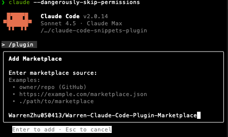
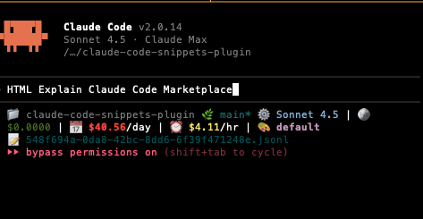

# Claude Context Orchestrator

**Version 3.0.0** - Hybrid context management system combining Agent Skills + deterministic snippets

A comprehensive Claude Code plugin that orchestrates two complementary context injection systems:

1. **Agent Skills** - Model-invoked capabilities for skill management and advanced workflows (Anthropic skills + custom meta-skills)
2. **Deterministic Snippets** - Hook-based pattern matching for reliable, always-on context injection

This hybrid architecture provides both intelligent, on-demand context (skills) and predictable, rule-based context (snippets) working seamlessly together.

> **Note**: Version 3.0 reflects the plugin's true hybrid nature. See [MIGRATION_GUIDE.md](MIGRATION_GUIDE.md) for version history.

## Overview

This plugin includes five meta-skills that help you manage your Agent Skills effectively:

1. **Managing Skills** - Comprehensive guidance for overall skill management and best practices
2. **Creating Skills** - Step-by-step instructions for authoring new skills
3. **Updating Skills** - Guide for modifying and refining existing skills
4. **Deleting Skills** - Safe removal of skills with backup strategies
5. **Reading Skills** - Listing, viewing, and inspecting available skills

## What are Agent Skills?

Agent Skills are a first-class feature in Claude Code that package expertise into discoverable capabilities. Claude autonomously decides when to use skills based on your request and the skill's description.

**Key benefits**:
- 🧠 **Model-invoked**: Claude decides when skills are relevant
- 📉 **Token-efficient**: Progressive disclosure loads content only when needed
- 🤝 **Team-friendly**: Share skills via git and plugins
- 📚 **Best practices**: Follow official Anthropic guidelines
- 🔍 **Smart discovery**: Skills activate based on task context

## Installation

### Step 1: Add the Marketplace

```bash
/plugin marketplace add WarrenZhu050413/Warren-Claude-Code-Plugin-Marketplace
```

<figure>
  
  <figcaption>Add the Warren Claude Code Plugin Marketplace</figcaption>
</figure>

### Step 2: Install the Marketplace

<figure>
  
  <figcaption>Confirm the marketplace installation</figcaption>
</figure>

### Step 3: Install the Plugin

```bash
/plugin install claude-context-orchestrator@warren-claude-code-plugin-marketplace
```

<figure>
  
  <figcaption>Browse available plugins and install <code>claude-context-orchestrator</code></figcaption>
</figure>

### Step 4: Verify Installation

Ask Claude:
```
What skills are available?
```

You should see the five meta-skills listed.

## Quick Start

### Ask Claude for Help

Once installed, simply ask Claude questions about skills:

**Creating a skill**:
```
Help me create a skill for HTML output formatting
```

**Updating a skill**:
```
My Docker skill isn't activating when I mention containers. Can you help?
```

**Viewing skills**:
```
What skills are available?
```

**Deleting a skill**:
```
I want to safely remove my old testing skill
```

Claude will autonomously use the appropriate meta-skill to guide you through the process.

### Create Your First Skill

**You**: "I want to create a skill for HTML output formatting"

**Claude** (uses "Creating Skills" skill):
- Guides you through choosing a skill location
- Helps write an effective description with trigger terms
- Shows you how to structure the SKILL.md file
- Explains how to test and refine your skill

### Example Interaction

<figure>
  
  <figcaption>Claude uses the Creating Skills meta-skill to guide you through the process</figcaption>
</figure>

## Meta-Skills Reference

### 📋 Managing Skills

**When Claude uses it**: Questions about skill management, best practices, or overall strategy

**What it covers**:
- Core principles (conciseness, progressive disclosure, clear descriptions)
- Skill structure and naming conventions
- Best practices and common patterns
- Troubleshooting and debugging

**Example triggers**:
- "What are best practices for skills?"
- "How should I organize my skills?"
- "Tell me about skill management"

### ✨ Creating Skills

**When Claude uses it**: Creating new skills from scratch

**What it covers**:
- Choosing skill location (personal, project, plugin)
- Writing effective descriptions with trigger terms
- Naming conventions (gerund form preferred)
- Content guidelines and common patterns
- Testing and validation

**Example triggers**:
- "How do I create a new skill?"
- "Help me author a skill for PDF processing"
- "I want to make a skill for Docker"

### 🔧 Updating Skills

**When Claude uses it**: Modifying existing skill content

**What it covers**:
- Quick update process
- Common update scenarios
- Refactoring patterns
- Version management
- Testing updates
- Rollback strategies

**Example triggers**:
- "Update my skill description"
- "My skill needs better examples"
- "How do I refine my skill?"

### 🗑️ Deleting Skills

**When Claude uses it**: Removing skills safely

**What it covers**:
- Safe deletion process
- Backup strategies
- Bulk deletion
- Version control best practices
- Recovery procedures

**Example triggers**:
- "Delete my old skill"
- "Remove unused skills"
- "How do I safely delete a skill?"

### 📖 Reading Skills

**When Claude uses it**: Listing and viewing skills

**What it covers**:
- Listing skills by location
- Viewing skill metadata
- Searching within skills
- Validation checks
- Generating skill inventories

**Example triggers**:
- "What skills are available?"
- "Show me my skills"
- "List all skills"

## How It Works

### The Magic of Model-Invoked Skills

Unlike the old snippet injection system (v1.0), skills are **model-invoked**:

1. **You ask a question**: "Help me create a skill for Docker"
2. **Claude reads meta-skill descriptions**: Sees "Creating Skills" mentions "create", "author", "new skill"
3. **Claude autonomously activates the skill**: Loads "Creating Skills" SKILL.md
4. **Claude guides you**: Follows the skill's instructions to help you
5. **Progressive disclosure**: If you need advanced info, Claude loads reference files

**No hooks, no regex patterns, no manual injection** - Claude just knows when to use skills!

### Compared to v1.0 (Snippets)

| Feature | v1.0 (Snippets) | v2.0 (Skills) |
|---------|-----------------|---------------|
| Activation | Regex pattern match | Claude decides based on context |
| Loading | Always injected on match | Progressive disclosure |
| Token usage | Full content every time | Only what's needed |
| Management | CLI tools | Ask Claude naturally |
| Team sharing | Git + config files | Git + native Claude Code |
| Discovery | Must know pattern | Discover by asking Claude |

## Architecture

### Plugin Structure

```
claude-context-orchestrator/
├── .claude-plugin/
│   └── plugin.json              # Plugin manifest
├── skills/                       # Agent Skills
│   ├── ANTHROPIC_SKILLS_LICENSE # Apache 2.0 license for Anthropic skills
│   ├── ANTHROPIC_SKILLS_NOTICE  # Attribution and modification details
│   ├── README.md                # Skills documentation
│   ├── managing-skills/         # Custom meta-skills
│   ├── creating-skills/
│   ├── updating-skills/
│   ├── deleting-skills/
│   ├── reading-skills/
│   ├── managing-snippets/
│   ├── building-artifacts/      # Anthropic skills
│   ├── building-mcp/
│   ├── testing-webapps/
│   ├── theming-artifacts/
│   ├── using-codex/             # Warren's custom skills
│   ├── using-claude/
│   ├── searching-deeply/
│   └── making-clearer/
├── snippets/                     # Snippet configurations
├── commands/                     # Slash commands (snippet management)
├── hooks/                        # Hook configuration for snippet injection
│   └── hooks.json
├── scripts/                      # Python CLI tools
│   ├── snippet_injector.py      # UserPromptSubmit hook
│   ├── snippets_cli.py          # Snippet CRUD operations
│   └── config*.json             # Snippet configurations
├── templates/                    # Reusable templates
├── LICENSE                       # MIT License (with Apache notice)
├── MIGRATION_GUIDE.md           # Version history
└── README.md                    # This file
```

### Skill Structure Example

Each meta-skill follows best practices:

```yaml
---
name: Creating Skills
description: Guides the creation of new Agent Skills in Claude Code following best practices. Use when creating, authoring, or writing new skills.
---

# Creating Skills

## Quick Start
[Brief overview]

## Detailed Guidance
[Step-by-step instructions]

## Examples
[Concrete examples]

## Best Practices
[Guidelines and tips]
```

## Best Practices

### From the Meta-Skills

The meta-skills embody best practices from official Anthropic documentation:

1. **Be Concise**: Assume Claude is smart, only add what it doesn't know
2. **Use Progressive Disclosure**: Keep SKILL.md under 500 lines, split large content
3. **Write Specific Descriptions**: Include what, when, and trigger terms
4. **Keep Skills Focused**: One skill = one capability
5. **Use Consistent Terminology**: Choose one term and stick to it
6. **Test Thoroughly**: Verify skills activate on relevant queries

### Skill Naming

**Prefer gerund form** (verb + -ing):
- ✅ "Processing PDFs"
- ✅ "Analyzing Spreadsheets"
- ✅ "Managing Databases"

**Avoid**:
- ❌ "Helper", "Utils", "Tools"
- ❌ Too generic: "Documents", "Data"

### Description Writing

**Good example**:
```yaml
description: Extract text and tables from PDF files, fill forms, merge documents. Use when working with PDF files or when user mentions PDFs, forms, or document extraction.
```

Includes:
- ✅ What it does
- ✅ When to use it
- ✅ Trigger terms users would mention

**Bad example**:
```yaml
description: Helps with documents
```

Too vague, no trigger terms.

## Migration from v1.0

If you were using the old snippet injection system, see [MIGRATION_GUIDE.md](MIGRATION_GUIDE.md) for detailed instructions.

**Quick summary**:
1. Review existing commands in `commands/local/`
2. Convert high-value commands to skills
3. Create `skills/` directory structure
4. Add YAML frontmatter with descriptions
5. Test with relevant queries
6. Archive old snippets (optional)

**Why migrate?**
- Official Claude Code feature (not a hack)
- More token-efficient
- Smarter activation
- Better team collaboration
- Follows best practices

## Troubleshooting

### Meta-Skill Not Activating

**Check installation**:
```bash
/plugin
```

Verify "claude-code-skills-manager" is installed and enabled.

**Ask explicitly**:
```
Use the Creating Skills skill to help me
```

**Restart Claude Code**: Skills load on startup

### Want to See Meta-Skill Content

**Find plugin location**:
```bash
find ~/.claude/plugins -name "managing-skills"
```

**Read the skill**:
```bash
cat ~/.claude/plugins/.../skills/managing-skills/SKILL.md
```

**Or open in editor**:
```bash
code ~/.claude/plugins/.../skills/managing-skills/SKILL.md
```

### Skills Conflict

If meta-skills conflict with your own skills:
- Make your skill descriptions more specific
- Use distinct trigger terms
- Consider different naming (avoid "Creating X", "Managing X")

## Advanced Usage

### Creating Your Own Meta-Skills

You can create meta-skills that reference these meta-skills!

**Example**: A "Project Setup" skill that tells Claude to use "Creating Skills" to help set up project-specific skills.

### Extending the Meta-Skills

Fork this plugin and:
1. Add more reference documentation
2. Create skill templates
3. Add examples for your domain
4. Share back with the community!

### Using with Personal Skills

The meta-skills work for:
- **Plugin skills** (in this plugin's `skills/` directory)
- **Personal skills** (`~/.claude/skills/`)
- **Project skills** (`.claude/skills/` in your projects)

Ask Claude about any skill location!

## Documentation

Comprehensive documentation is available in the `docs/` directory:

### Getting Started
- **[Installation Guide](docs/installation.md)** - Detailed installation and setup instructions
- **[Quick Start](docs/quickstart.md)** - Get up and running in minutes
- **[Getting Started](docs/getting-started.md)** - Overview and basic concepts

### Configuration & Usage
- **[Configuration Guide](docs/configuration.md)** - Configure snippets and skills
- **[Commands Reference](docs/commands-reference.md)** - All available slash commands
- **[Template Pattern](docs/template-pattern.md)** - Creating skills with templates
- **[Multi-Config Guide](docs/multi-config-guide.md)** - Managing multiple configurations

### Troubleshooting
- **[Troubleshooting](docs/troubleshooting.md)** - Common issues and solutions
- **[Documentation Index](docs/INDEX.md)** - Complete documentation index

## Support & Contributing

- **Issues**: Report bugs or request features via [GitHub issues](https://github.com/WarrenZhu050413/Warren-Claude-Code-Plugin-Marketplace/issues)
- **Documentation**:
  - [Claude Code Skills Docs](https://docs.claude.com/en/docs/claude-code/skills.md)
  - [Best Practices](https://docs.claude.com/en/docs/agents-and-tools/agent-skills/best-practices.md)
  - [Plugin Development](https://docs.claude.com/en/docs/claude-code/plugins.md)
- **Community**: Share your skills and learn from others!

### Contributing

Improvements welcome! Especially:
- Better examples in meta-skills
- More reference documentation
- Templates for common skill types
- Real-world skill examples

## Acknowledgments

### Anthropic Agent Skills

This plugin includes Agent Skills from [Anthropic's example-skills repository](https://github.com/anthropics/skills), licensed under Apache License 2.0:

- **building-artifacts** - React + Tailwind CSS + shadcn/ui artifact builder
- **building-mcp** - MCP server development guide
- **testing-webapps** - Playwright-based web testing
- **theming-artifacts** - Professional artifact theming

Copyright (c) 2024-2025 Anthropic, PBC. See `skills/ANTHROPIC_SKILLS_LICENSE` and `skills/ANTHROPIC_SKILLS_NOTICE` for complete attribution.

### Additional Acknowledgments

- Custom skill management skills based on [official Anthropic documentation](https://docs.claude.com/en/docs/agents-and-tools/agent-skills/best-practices.md)
- Inspired by the agent skills team at Anthropic
- Built on the Claude Code plugin system

Special thanks to the Claude Code team for making Agent Skills a first-class feature!

## Version History

### v3.0.0 (2025-10-21) - Hybrid Architecture Recognition

- **RENAMED**: "claude-code-skills-manager" → "claude-context-orchestrator"
- **ARCHITECTURE**: Clarified hybrid nature (Agent Skills + deterministic snippets)
- **LICENSING**: Added main MIT LICENSE file with Apache 2.0 notice for Anthropic skills
- **ACKNOWLEDGMENTS**: Enhanced attribution for Anthropic example-skills
- **DOCUMENTATION**: Updated README to reflect dual-system architecture
- Integrated Anthropic skills: building-artifacts, building-mcp, testing-webapps, theming-artifacts
- Custom skills: using-codex, using-claude, searching-deeply, making-clearer, managing-snippets

### v2.0.0 (2025-10-16) - Skills Revolution

- **BREAKING**: Complete rewrite from snippet injection to Agent Skills
- Added five meta-skills for comprehensive skill management
- Removed hook-based injection system (moved to optional/legacy)
- Updated plugin manifest to include skills directory
- Added comprehensive migration guide
- Renamed from "claude-code-snippets" to "claude-code-skills-manager"
- Based on official Anthropic best practices

### v1.0.0 (2025-10-12) - Initial Release

- Hook-based snippet injection with regex patterns
- CLI tools for snippet management
- Template pattern for complex snippets
- 20+ example snippets

## License

This plugin is dual-licensed:

- **Main plugin**: MIT License - see [LICENSE](LICENSE) file for details
- **Anthropic skills** (building-artifacts, building-mcp, testing-webapps, theming-artifacts): Apache License 2.0 - see [skills/ANTHROPIC_SKILLS_LICENSE](skills/ANTHROPIC_SKILLS_LICENSE) and [skills/ANTHROPIC_SKILLS_NOTICE](skills/ANTHROPIC_SKILLS_NOTICE)

## Author

**Fucheng Warren Zhu**
- Email: wzhu@college.harvard.edu
- GitHub: [@WarrenZhu050413](https://github.com/WarrenZhu050413)

---

*Built with ❤️ using Claude Code and Agent Skills*
