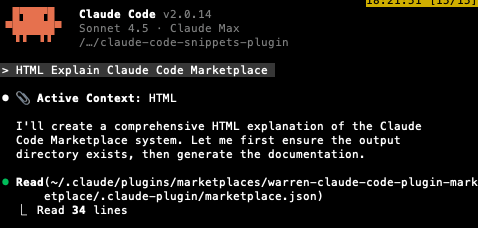

# Claude Context Orchestrator

Regex-based context injection for Claude Code. Type keywords like `SKILL` or `SNIPPET` to automatically load relevant context.

## How It Works

When you type a message containing a trigger keyword (e.g., `LATEX`, `ARTIFACT`, `GMAIL`), the hook injects matching content into Claude's context via regex pattern matching on the `UserPromptSubmit` event.

**Two injection types:**
- **Skills** (`skills/`) - Procedural guides Claude loads when relevant (model-invoked)
- **Snippets** (`snippets/`) - Pattern-triggered context (hook-based)

## Installation


```bash
/plugin marketplace add file:///path/to/warren-claude-code-plugin-marketplace
```


```bash
/plugin install claude-context-orchestrator@warren-claude-code-plugin-marketplace
```


## Quick Start

### Using Keywords

Type trigger words in ALL CAPS to load context:

```
Help me with GMAIL             → loads gmail-assistant skill
I need to LATEX this document  → loads latex snippet
Build an ARTIFACT for me       → loads artifact builder skill
```


When a snippet is active, you'll see it in the context:



## Snippets CLI

The snippets CLI is the **key tool** for managing pattern-triggered context.

### Installation

```bash
cd scripts/snippets
make install
```

### Core Commands

```bash
snippets                # List all snippets with status
snippets paths          # Show snippet locations
snippets validate       # Check config for errors
```

### Search (Most Important!)

The search command is your primary way to find snippets:

```bash
# Search by name, pattern, or description
snippets search gmail           # Find gmail-related snippets
snippets search "output"        # Find output format snippets
snippets search latex           # Find latex snippets

# Search with fuzzy matching (default)
snippets search latx            # Still finds "latex" snippets

# Interactive search
snippets search -i              # Opens interactive picker
```

**Search tips:**
- Searches across name, pattern, description, and file paths
- Case-insensitive by default
- Use quotes for multi-word searches: `snippets search "code style"`

### Creating Snippets

```bash
# Create from existing markdown file
snippets create my-guide.md snippets/local/category/

# Interactive creation
snippets create -i
```

### Updating Snippets

```bash
# Update pattern
snippets update my-snippet --pattern "\\b(NEW|PATTERN)\\b[.,;:!?]?"

# Enable/disable
snippets update my-snippet --enabled false
snippets update my-snippet --enabled true
```

### Listing with Filters

```bash
snippets list                   # All snippets
snippets list --enabled         # Only enabled
snippets list --disabled        # Only disabled
snippets list --show-stats      # With statistics
```


## Creating a Snippet Manually

1. **Create the content file** with YAML frontmatter:
   ```markdown
   ---
   name: "My Snippet"
   description: "When to use this"
   ---

   Content here...
   ```

2. **Add pattern to config.local.json:**
   ```json
   {
     "name": "my-snippet",
     "pattern": "\\b(MYSNIPPET|MY_SNIPPET)\\b[.,;:!?]?",
     "snippet": ["snippets/local/category/my-snippet/SNIPPET.md"],
     "enabled": true
   }
   ```

3. **Test:** Type `MYSNIPPET` in a prompt.

## Pattern Format

All patterns follow this format:
```
\b(PATTERN)\b[.,;:!?]?
```

Rules:
- ALL CAPS keywords
- Word boundaries (`\b`)
- Optional punctuation (`[.,;:!?]?`)
- Double-escape in JSON: `\\b`

Examples:
```
\\b(GMAIL|EMAIL)\\b[.,;:!?]?
\\b(LATEX|LATEXSTYLE)\\b[.,;:!?]?
\\b(BUILD_ARTIFACT|ARTIFACT)\\b[.,;:!?]?
```

## Structure

```
claude-context-orchestrator/
├── skills/                    # Model-invoked capabilities
│   ├── gmail-assistant/       # Email workflows
│   ├── google-drive/          # Drive file operations
│   ├── building-artifacts/    # HTML artifact builder
│   └── ...
├── snippets/                  # Pattern-triggered context
│   └── local/                 # Personal snippets
│       ├── output-formats/    # Formatting guides
│       ├── documentation/     # Reference material
│       └── ...
├── scripts/
│   └── snippets/              # Snippets CLI
│       ├── config.json        # Base config (committed)
│       └── config.local.json  # Personal config (gitignored)
└── hooks/
    └── hooks.json             # UserPromptSubmit hook
```

## Available Keywords

Here are some commonly used keywords:

| Keyword | Loads | Description |
|---------|-------|-------------|
| `GMAIL` | gmail-assistant | Email workflows |
| `GDRIVE` | google-drive | Drive file operations |
| `ARTIFACT` | building-artifacts | HTML artifact creation |
| `LATEX` | latex-style | LaTeX document formatting |
| `TDD` | following-tdd | Test-driven development |
| `SKILL` | managing-skills | Skill management |
| `SNIPPET` | managing-snippets | Snippet management |

Run `snippets list` for the full list.

## License

MIT (Apache 2.0 for Anthropic-derived skills in `skills/`)

Hope you enjoy!
