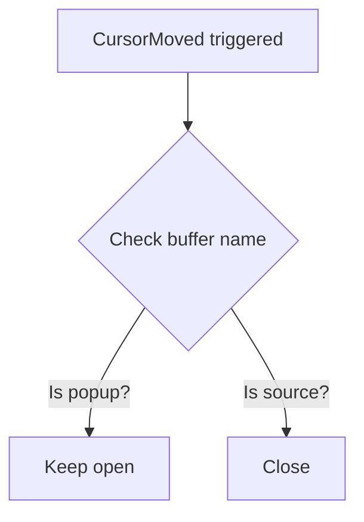

# Pedagogical Journey - Advanced Reference

Detailed patterns, examples, and format-specific guidelines for creating journey-focused explanations.

## Format-Specific Guidelines

### EXPLAIN as HTML

When combining with HTML format:

**1. Structure Mapping:**
- **Summary** → `.important-always-visible` or `.primary-section` [REQUIRED]
- **Journey** → `.card.priority` with gold border [REQUIRED]
- **Visual** → Mermaid diagrams in `.diagram-container` [OPTIONAL]
- **Key Changes** → `.two-column-layout` for side-by-side comparison [OPTIONAL]
- **Technical Details** → `.collapsible` (closed by default) [OPTIONAL]
- **What to Try Next** → `.card` with action items [OPTIONAL]

**2. Progressive Disclosure:**
- Summary and Journey always visible at top (REQUIRED)
- Other sections only if they add value
- Technical details in collapsible sections
- Color coding: Gold for insights, Green for outcomes, Gray for details

**3. Visual Enhancement:**
- Use Mermaid flowcharts to show decision trees ("tried X → discovered Y → chose Z")
- Timeline diagrams for implementation journey
- Before/after comparison diagrams

**4. Workflow:**
1. Read base template: `${CLAUDE_PLUGIN_ROOT}/templates/html/base-template.html`
2. Write to: `claude_html/explanation_{topic}.html`
3. Edit to add pedagogical-journey-structured content
4. Include required sections + relevant optional ones
5. Open with `open` command

### EXPLAIN as Markdown

When using markdown format:

1. Use standard markdown headers (`##`, `###`) for sections
2. Use `> **Journey Insight:**` blockquotes for key discoveries
3. Use mermaid code fences for diagrams (if Visual section included)
4. Use tables for before/after comparisons (if Key Changes included)
5. Use task lists for "What to Try Next"
6. **Only include optional sections when they're valuable**

### EXPLAIN as Plain Text

When using plain text:

1. Use clear section separators (`===`, `---`)
2. Use indentation to show hierarchy
3. Use ASCII art or structured lists for visualizations
4. Keep it simple and scannable
5. Focus on required sections, add optional ones sparingly

## Full Example: EXPLAIN as HTML

```
[.important-always-visible]
I've implemented X to solve Y problem. This involved modifying A and B components, and adding new C functionality.

[.card.priority with gold border]
**How we got here:**
Initially the CursorMoved autocmd was closing popups globally. Testing revealed this was the root cause - popups were created successfully but closed immediately. The fix checks if we're inside the popup before closing.

[Mermaid flowchart - OPTIONAL, included because it clarifies decision logic]
CursorMoved triggered → Check buffer name → Is it popup? → Yes: Keep open / No: Close

[.two-column-layout - OPTIONAL, included because there's a before/after comparison]
**Key Changes:**
| Before | After |
|--------|-------|
| Popup closes on ANY cursor move | Popup stays open when cursor in popup |
| Global autocommand | Buffer-aware check |

[.collapsible closed - OPTIONAL, included because user might want implementation details]
**Technical Details:**
The implementation works by checking buffer names in the CursorMoved callback. The decision to use buffer name matching came from the constraint that popup buffers have predictable names. You can see this in action at init.lua:232 and popup.lua:338.

[.card - OPTIONAL, included because there are actionable next steps]
**Try it out:**
1. Test with: Press <leader>aa on an annotation
2. Explore: Try moving cursor within popup vs outside
3. Ask me about: Why buffer names vs window IDs?
```

## Full Example: EXPLAIN as Markdown

```markdown
# Implementation Summary

I've implemented X to solve Y problem. This involved modifying A and B components, and adding new C functionality.

## How We Got Here

Initially the CursorMoved autocmd was closing popups globally. Testing revealed this was the root cause - popups were created successfully but closed immediately.

> **Journey Insight:** The key breakthrough came from realizing that the popup buffer has a predictable name pattern, which we could use to distinguish it from regular buffers.

The fix checks if we're inside the popup before closing, adding a buffer name check to only close popups when cursor moves in source files.

## Decision Logic



## Key Changes

| Aspect | Before | After |
|--------|--------|-------|
| Behavior | Popup closes on ANY cursor move | Popup stays open when cursor inside |
| Implementation | Global autocommand | Buffer-aware check |
| Reliability | Unreliable for nested UIs | Works with complex UIs |

## Technical Details

<details>
<summary>Click to expand implementation details</summary>

The implementation works by checking buffer names in the CursorMoved callback. The decision to use buffer name matching came from the constraint that popup buffers have predictable names.

You can see this in action at:
- `init.lua:232` - Autocommand registration
- `popup.lua:338` - Buffer name check logic

The buffer name pattern is: `popup_*_buffer`

</details>

## What to Try Next

- [ ] Test with: Press <leader>aa on an annotation
- [ ] Explore: Try moving cursor within popup vs outside
- [ ] Ask: Why buffer names vs window IDs?
```

## Journey Insight Examples

How to highlight key discoveries in your explanations:

### Example 1: Implementation Discovery
```
Initially I tried X, but discovered Y limitation which led to the current Z approach.
```

### Example 2: Pattern Recognition
```
The key insight came from noticing [pattern/behavior], which informed the entire refactoring.
```

### Example 3: Testing-Driven Discovery
```
During testing, I found [issue], which revealed the need for a more robust approach.
```

### Example 4: Architecture Realization
```
After implementing the first version, I realized [constraint], which led us to adopt [new pattern].
```

## Section Balance Guide

### When to Include Each Optional Section

**Visual Overview** - Include when:
- You're explaining architecture changes (show with diagrams)
- Multiple components interact (flowchart helps)
- File structure significantly changed (tree diagram)
- Process flow isn't obvious (sequence diagram)
- The system is genuinely complex

**Key Changes** - Include when:
- More than one component was modified
- Changes span multiple layers/domains
- User needs to understand scope
- Before/after comparison adds clarity

**Technical Details** - Include when:
- Implementation is non-trivial
- User specifically asked for deep details
- Design decisions need explanation
- Integration points are complex

**What to Try Next** - Include when:
- There are clear testing steps
- Natural follow-up work exists
- User might want to build on changes
- Areas to explore are obvious

## Common Pitfalls to Avoid

### ❌ Too Exhaustive
```
The journey was: I started with approach A, then tried B, then C,
then considered D, then revisited A...
```

✅ **Better:**
```
Initially I tried approach A, but discovered it didn't scale. This led
to the current approach B which handles the edge case better.
```

### ❌ Missing the Journey
```
I modified file X and file Y. File X now has function Z.
```

✅ **Better:**
```
Testing revealed that the original single-file approach created
tight coupling. Splitting into X and Y decouples the concerns.
```

### ❌ Too Technical Without Context
```
Modified CursorMoved autocommand callback to check buffer name patterns.
```

✅ **Better:**
```
The CursorMoved autocommand was closing popups globally. Testing showed
that checking the buffer name lets us distinguish popups from regular
windows—popups stay open, source windows close.
```

### ❌ Unnecessary Details
```
First I created 47 test cases covering 12 edge cases. Then I ran
the test suite which took 3 minutes and 42 seconds...
```

✅ **Better:**
```
Testing revealed an edge case where nested popups would interfere.
This led to the buffer-aware approach that isolates popup state.
```

## Best Practices Summary

- **Concise**: 2-4 sentences for journey, not paragraphs
- **Connected**: Link each insight to the final solution
- **Concrete**: Use specific examples (not "edge cases", but "nested popups")
- **Clear**: Explain the "why" not every "how"
- **Candid**: Show what you tried that didn't work
- **Curious**: Leave room for follow-up questions

## Minimal vs. Full

### Minimal (Required Sections Only)
Use when:
- The change is straightforward
- User is in a hurry
- The journey is simple
- No complex dependencies

```
I've fixed the popup issue where they were closing immediately after opening.

**How we got here:**
Initially I suspected the popup code itself, but debugging revealed the
CursorMoved autocommand was closing popups globally. The fix adds a
buffer name check to only close popups when cursor moves in source files,
not within the popup itself.
```

### Full (All Sections)
Use when:
- Multiple components changed
- Architecture decision was significant
- User wants to understand deeply
- There are clear next steps

Use the full example in the previous section as a template.

---

**Remember**: This is an invitation for dialogue. Show the journey of discovery without making it exhaustive. Include only sections that genuinely enhance understanding. Keep explanations accessible and leave room for curiosity.
