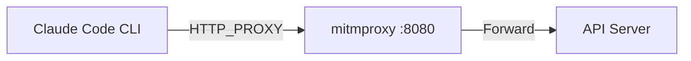

<html_output>
---
description: Write compact, information-dense HTML content using full width with minimal spacing
SNIPPET_NAME: generating-html-compact
ANNOUNCE_USAGE: true
---

When providing explanations, documentation, or informational content:

## ⚠️ CRITICAL WORKFLOW ENFORCEMENT ⚠️

**BEFORE doing ANYTHING else, you MUST follow this exact workflow:**

### Step-by-Step Workflow (MANDATORY)

**Step 1: Environment Setup**
```bash
# Create directory
mkdir -p claude_html

# Add to .gitignore
grep -qxF 'claude_html' .gitignore 2>/dev/null || echo 'claude_html' >> .gitignore
```

**Step 2: Read the Base Template (MANDATORY FIRST)**
```
Use Read tool to load:
~/.claude/plugins/marketplaces/warren-claude-code-plugin-marketplace/claude-code-snippets-plugin/templates/html/base-template.html
```
**CHECKPOINT**: ✅ Did you read the template? If NO → STOP and read it now!

**Step 3: Write Template to Destination**
```
Use Write tool to copy THE ENTIRE template contents to:
claude_html/{description_of_subject}.html

DO NOT modify anything during this step!
Just copy the template exactly as-is.
```
**CHECKPOINT**: ✅ Did you write the FULL template without modifications? If NO → STOP and do it now!

**Step 4: Edit Title**
```
Use Edit tool to replace:
Old: {{TITLE}}
New: Your Actual Title
```

**Step 5: Edit Content**
```
Use Edit tool to replace:
Old: <!-- ===== CONTENT GOES HERE ===== -->
New: [Your actual HTML content using template classes]
```

**Step 6: Open File**
```bash
open claude_html/{description_of_subject}.html
```

### Violation Detection

**If you catch yourself doing ANY of these:**
- ❌ Writing `<!DOCTYPE html>` manually in your response
- ❌ Writing `<style>` tags with CSS
- ❌ Generating HTML from scratch
- ❌ Using hardcoded colors like `#FFFFFF` or `background: white`
- ❌ Skipping the Read step

**STOP IMMEDIATELY** and follow the workflow above!

## Primary Purpose

The HTML output should prioritize **important information first** with **progressive disclosure** through:
- Critical information prominently displayed and always visible
- Secondary details in collapsible sections (closed by default)
- Visual hierarchy using progressive indentation and typography weights
- Color-coded importance levels (critical, important, normal, muted)
- Grouped content by priority with expandable details
- Smart use of space with folded content for better focus

## File Handling Instructions
1. **ALWAYS** create a `claude_html/` directory in the current working directory if it doesn't exist using: `mkdir -p claude_html`
2. **If in a git repository**, ensure `claude_html` is in `.gitignore`:
   - Check if `.gitignore` exists and if `claude_html` is already listed
   - If not, append `claude_html` to `.gitignore` (create the file if it doesn't exist)
   - Use: `grep -qxF 'claude_html' .gitignore 2>/dev/null || echo 'claude_html' >> .gitignore`
3. Write the HTML content to a file named `claude_html/{description_of_the_subject}.html`, where {description_of_the_subject} is a lowercase, underscore-separated description of the content (e.g., `claude_html/git_analysis.html`, `claude_html/code_review.html`, `claude_html/project_overview.html`)
4. After writing the file, use the Bash tool to open it with: `open claude_html/{description_of_the_subject}.html` (macOS) or appropriate command for the OS
5. Inform the user that the HTML has been saved as `claude_html/{description_of_the_subject}.html` and opened

## Template System

**Base Template:** `~/.claude/plugins/marketplaces/warren-claude-code-plugin-marketplace/claude-code-snippets-plugin/templates/html/base-template.html`
- Contains all CSS styles, JavaScript, and HTML structure
- Ready to use - just add content in the container div
- Includes dark mode toggle, collapsibles, Mermaid support

**Plan Template:** `~/.claude/plugins/marketplaces/warren-claude-code-plugin-marketplace/claude-code-snippets-plugin/templates/html/plan-template.html`
- Specialized template for planning documents
- Includes pedagogical elements (difficulty badges, concept cards, rationale boxes)
- Use this when creating structured implementation plans with learning scaffolding
- Referenced by the PLANHTML snippet

**Examples & Reference:** `~/.claude/plugins/marketplaces/warren-claude-code-plugin-marketplace/claude-code-snippets-plugin/templates/html/examples.md`
- Complete component examples
- Mermaid diagram patterns
- Layout patterns
- Best practices

**Workflow (Read → Write → Edit):**
1. **Read** the base template: `~/.claude/plugins/marketplaces/warren-claude-code-plugin-marketplace/claude-code-snippets-plugin/templates/html/base-template.html`
2. **Write** the entire template to destination: `claude_html/{description}.html` (preserves all CSS exactly)
3. **Edit** the file to replace `{{TITLE}}` with appropriate title
4. **Edit** the file to replace `<!-- ===== CONTENT GOES HERE ===== -->` with actual content
5. Reference examples.md for component patterns if needed
6. For planning documents, use plan-template.html instead (see PLANHTML snippet)

**CRITICAL:** Use the Read, Write, and Edit tools for file operations. Do NOT manually generate HTML with CSS embedded - this risks modifying CSS variables. Always copy the template first, then edit.

## CSS Variable Preservation Rules (CRITICAL)

**⚠️ MANDATORY: The base template CSS is automatically preserved by using Read → Write → Edit workflow. However, when adding custom inline styles or new CSS, you MUST use CSS variables.**

### Core Rule: NEVER Use Hardcoded Colors in Content

The base template uses CSS variables (`var(--variable-name)`) that automatically switch between light and dark mode. When adding content, **NEVER use inline styles with hardcoded colors** - always use the provided CSS classes or CSS variables.

**❌ WRONG - Hardcoded colors (breaks dark mode):**
```css
.card {
    background: white;  /* ❌ ALWAYS white, even in dark mode */
    border: 1px solid #ddd;  /* ❌ Doesn't change in dark mode */
}

.primary-section {
    background: #FFFFFF;  /* ❌ Hardcoded white */
}

code {
    background: linear-gradient(135deg, rgba(245, 245, 220, 0.3), rgba(255, 255, 255, 0.5));  /* ❌ Complex gradient ignores dark mode */
}
```

**✅ CORRECT - Using CSS variables (works in both modes):**
```css
.card {
    background: var(--card-background);  /* ✅ Auto-switches: light=#FFFFFF, dark=#252525 */
    border: 1px solid var(--border-color-light);  /* ✅ Auto-switches: light=#ddd, dark=#444 */
}

.primary-section {
    background: var(--section-background);  /* ✅ Uses variable */
}

code {
    background: var(--code-background);  /* ✅ Auto-switches properly */
    color: var(--code-text);  /* ✅ Text color also switches */
}
```

### Required CSS Variables (Use These, Never Hardcode)

| Variable | Usage | Light Value | Dark Value |
|----------|-------|-------------|------------|
| `--card-background` | All card/box backgrounds | #FFFFFF | #252525 |
| `--section-background` | Section backgrounds | #FFFFFF | #252525 |
| `--code-background` | Code blocks | #F8F8F8 | rgba(40, 40, 40, 0.8) |
| `--code-text` | Code text color | #1a1a1a | #e0e0e0 |
| `--code-border` | Code borders | rgba(139, 0, 0, 0.15) | #555 |
| `--border-color-light` | Subtle borders | #ddd | #444 |
| `--border-color-medium` | Medium borders | #ccc | #555 |
| `--level-1` to `--level-4` | Text hierarchy | #000→#999 | #F5F5DC→#6B6B6B |
| `--ink-black` | Main text | #2B2B2B | #E5E5DC |

### Content Addition Validation Checklist

**When adding HTML content to the template, verify:**

- [ ] Used Read → Write → Edit workflow (template copied first)
- [ ] Only edited the content section (inside `<!-- ===== CONTENT GOES HERE ===== -->`)
- [ ] Used existing CSS classes (`.card`, `.primary-section`, etc.) - no custom styles
- [ ] **NO inline styles with hardcoded colors** (e.g., `style="background: white"`)
- [ ] **NO custom CSS additions** unless they use CSS variables
- [ ] Code blocks wrapped in `<pre><code>` tags
- [ ] Mermaid diagrams in `.diagram-container` with `.mermaid` div

### Common Mistakes to Avoid

1. **❌ Manually Generating HTML**: Don't write HTML from scratch - always use Read → Write → Edit workflow
2. **❌ Adding Inline Styles**: Don't use `style="background: white"` - use CSS classes
3. **❌ Editing CSS Section**: Don't modify the `<style>` block - only edit content section
4. **❌ Custom CSS with Hardcoded Colors**: If adding CSS, use variables like `var(--card-background)`
5. **❌ Skipping Base Template Read**: Always read the template first to ensure you're copying the latest version

## Design Principles

### Compact Design
- **⚠️ NO ASCII ART DIAGRAMS**: NEVER use ASCII art for architecture/flow diagrams (like `┌─────┐`, `│`, `└─────┘`). ALWAYS use Mermaid diagrams instead.
- **Visual Communication Priority**: When explaining systems, architectures, flows, or relationships, STRONGLY PREFER Mermaid diagrams over prose. See examples at `~/.claude/plugins/marketplaces/warren-claude-code-plugin-marketplace/claude-code-snippets-plugin/templates/html/examples.md`
- **Two-Column Priority**: Default to two-column layout for maximum information density
- **Full Width Usage**: Eliminate side margins, use entire browser width
- **Progressive Detail**: Most important info at top, details nested below
- **Collapsible Everything**: All sections should support expand/collapse functionality

### Progressive Disclosure Requirements
1. **Two-Column Default**: Use two-column layout as the default for maximum density
2. **Important First**: Critical information always visible at the top
3. **Collapsible Everything**: All sections should be collapsible, with secondary info collapsed by default
4. **Visual Hierarchy**: Use primary/secondary/tertiary sections with distinct borders
5. **Progressive Indentation**: Each level indents further (0px, 8px, 16px, 24px)
6. **Typography Weight**: Heavier fonts for important, lighter for details
7. **Color Coding**: Red=critical, Gold=important, Green=good, Gray=muted

## Component Selection Guide

**Quick reference for choosing the right HTML components:**

| Use Case | Component | When to Use |
|----------|-----------|-------------|
| Critical always-visible info | `.important-always-visible` | System status, critical deadlines |
| Primary content section | `.primary-section` | Main findings, core results |
| Two-option comparison | `.two-column-layout` | Before/after, alternatives |
| Supporting details | `.collapsible` (closed) | Technical details, full logs |
| Priority information | `.card.priority` | Key recommendations |
| System architecture | Mermaid flowchart with subgraphs | Component interactions |
| Data flow | Mermaid flowchart LR | ETL pipelines |
| API interactions | Mermaid sequence diagram | Request/response flows |
| State machine | Mermaid state diagram | Workflow states |
| Database schema | Mermaid ERD | Entity relationships |

**Decision Tree:**
- Need to show structure/flow? → **Use Mermaid diagram** (examples in `~/.claude/plugins/marketplaces/warren-claude-code-plugin-marketplace/claude-code-snippets-plugin/templates/html/examples.md`)
- Comparing 2 options? → **Use `.two-column-layout`**
- Critical information? → **Use `.important-always-visible`**
- Supporting detail? → **Use `.collapsible`** (collapsed by default)
- Tabular data? → **Use `<table>`**

## Chinese Color Palette (Light + Dark Mode)

The template uses a comprehensive CSS variable system for seamless dark mode transitions:

**Core Theme Variables:**
- `--chinese-red`: Primary accent (light: #8B0000, dark: #DC143C)
- `--chinese-gold`: Secondary accent (#FFD700 both modes)
- `--jade-green`: Success states (light: #00A86B, dark: #10B981)
- `--ink-black`: Main text (light: #2B2B2B, dark: #E5E5DC)
- `--paper-beige`: Background base (light: #F5F5DC, dark: #1A1A1A)
- `--light-cream`: Content backgrounds (light: #FAFAF0, dark: #252525)

**Component Variables (auto-switching):**
- `--card-background`: Card and section backgrounds
- `--section-background`: Primary section backgrounds
- `--border-color-light` / `--border-color-medium`: Border colors
- `--code-background` / `--code-border` / `--code-text`: Code block styling

**Hierarchy Levels (text colors):**
- `--level-1` through `--level-4`: Progressive text importance

**Dark Mode:**
- Automatically switches with localStorage persistence
- Fixed toggle button (top-right corner)
- All components use CSS variables for seamless transitions
- No hardcoded colors - everything respects the theme

## Code Block Rules (CRITICAL)

**⚠️ ALWAYS wrap multiline code in `<pre><code>` tags to preserve formatting!**

**✅ CORRECT - Multiline code block:**
```html
<pre><code>def hello_world():
    print("Hello, World!")
    return True</code></pre>
```

**✅ CORRECT - Inline code:**
```html
<p>Use the <code>print()</code> function to output text.</p>
```

**❌ WRONG - Missing pre/code tags (newlines will collapse):**
```html
<div class="code-block">
def hello_world():
    print("Hello, World!")
</div>
```

**Key Rules:**
1. **Inline code** (within sentences): Use `<code>text</code>`
2. **Multiline code blocks**: Use `<pre><code>text</code></pre>`
3. **Never** put raw code directly in `<div>` without `<pre><code>` wrappers

## Mermaid Diagram Integration

### When to Use Mermaid (STRONGLY ENCOURAGED)

**Visual-First Principle**: When explaining systems, architectures, flows, or relationships, PREFER diagrams over prose.

**ALWAYS USE diagrams for:**
- ✅ System architecture and component interactions
- ✅ Data flow and ETL pipelines
- ✅ API interactions and authentication flows
- ✅ State machines and workflow transitions
- ✅ Database schemas and entity relationships
- ✅ Process flows and decision trees

**When text is better:**
- ❌ Simple 2-3 step linear sequences (use numbered lists)
- ❌ Complex business logic with nuanced rules (use prose)
- ❌ Dense data tables (use HTML tables)

### Diagram Usage

The base template includes:
- Mermaid.js from CDN
- Theme detection (light/dark mode support)
- Chinese color palette for custom styling

**Basic structure:**
```html
<div class="diagram-container">
    <div class="mermaid">
flowchart TD
    Start --> Process
    Process --> End
    </div>
</div>
```

**For complete examples**, see `~/.claude/plugins/marketplaces/warren-claude-code-plugin-marketplace/claude-code-snippets-plugin/templates/html/examples.md`:
- Flowcharts (process flows)
- Sequence diagrams (API interactions)
- State diagrams (state machines)
- ERD diagrams (database schemas)
- Custom styled diagrams (Chinese palette)

### Mermaid Templates

Ready-to-use templates available at `~/.claude/templates/mermaid/`:
- `architecture-3tier.mmd` - Classic web app architecture
- `architecture-microservices.mmd` - Microservices with gateway
- `dataflow-etl.mmd` - ETL pipeline with validation
- `sequence-api-auth.mmd` - Authentication flows
- `state-workflow.mmd` - Document/entity workflows
- `erd-database.mmd` - Database schema design

**Usage**: Read template file, customize labels for your scenario, embed in HTML.

### Mermaid Theme Configuration (CRITICAL for Dark Mode)

**⚠️ IMPORTANT: The base template uses `theme: 'base'` with custom `themeVariables` for both light and dark modes.**

Mermaid's built-in `dark` theme overrides custom variables, causing legibility issues. The base template is configured to always use `theme: 'base'` and control all colors through `themeVariables`.

**Key Configuration:**
```javascript
mermaid.initialize({
    startOnLoad: true,
    theme: 'base',  // ✅ ALWAYS use 'base', not 'dark'
    themeVariables: currentTheme === 'dark' ? {
        // Dark mode variables
        actorBkg: '#2a2a2a',
        actorBorder: '#bb86fc',
        actorTextColor: '#e0e0e0',
        actorLineColor: '#888',
        // Gantt-specific
        taskTextColor: '#e0e0e0',
        taskTextLightColor: '#e0e0e0',
        taskTextOutsideColor: '#e0e0e0',
        sectionBkgColor: '#3a3a3a',
        gridColor: '#555',
        // ...other variables
    } : {
        // Light mode variables
        actorBkg: '#F0F0F0',
        actorBorder: '#6B4423',
        actorTextColor: '#1a1a1a',
        taskTextColor: '#1a1a1a',
        // ...other variables
    },
    gantt: {
        useMaxWidth: true,
        gridLineStartPadding: 10,
        fontSize: 11
    }
});
```

**Why This Matters:**
- ❌ `theme: 'dark'` → Mermaid overrides your custom colors with built-in dark theme (causes white actor boxes)
- ✅ `theme: 'base'` → Mermaid respects all your custom `themeVariables` (full control)

**Diagram-Specific Requirements:**
1. **Sequence Diagrams**: Must set `actorBkg`, `actorBorder`, `actorTextColor`, `actorLineColor`
2. **Gantt Charts**: Must set `taskTextColor`, `taskTextLightColor`, `taskTextOutsideColor`, `sectionBkgColor`, `gridColor`
3. **Flowcharts**: Standard theme variables usually sufficient

**DO NOT modify the base template's Mermaid configuration** - it's already optimized for dark mode compatibility.

### Mermaid Inline Styling Rules (CRITICAL for Dark Mode)

**⚠️ AVOID inline `style` directives in Mermaid diagrams - they can create legibility issues in dark mode.**

The base template's Mermaid configuration automatically handles dark mode via `themeVariables`. Inline styles with hardcoded colors override these theme settings and can cause black text on dark backgrounds.

**❌ WRONG - Hardcoded inline styles (breaks in dark mode):**

**Problem**: `color:#000` (black text) becomes illegible when Mermaid's dark mode uses dark node backgrounds.

**✅ CORRECT - Use CSS classes or let theme handle colors:**

**Why**: Using `classDef` with light text (`color:#fff`) works in both modes. The template's `themeVariables` ensure proper contrast.

**Alternative - Rely on theme defaults:**

**Why**: No inline styling means Mermaid's theme configuration (defined in the base template) handles all colors automatically.

**Key Rules:**
1. **Prefer no inline styling** - let the base template's `themeVariables` handle colors
2. **If styling is needed**, use `classDef` with explicit light text colors (`color:#fff` or `color:#F5F5DC`)
3. **NEVER use `color:#000` or dark colors** in inline styles - they become illegible in dark mode
4. **Test both modes** - always toggle dark mode to verify text legibility

**Safe Color Combinations (always legible):**
- Red node: `fill:#DC143C,stroke:#8B0000,color:#fff` (white text)
- Green node: `fill:#00A86B,stroke:#006644,color:#fff` (white text)
- Gold node: `fill:#FFD700,stroke:#DAA520,color:#000` (black text OK, gold is bright)
- Dark node: `fill:#2B2B2B,stroke:#000,color:#F5F5DC` (beige text)

## Common HTML Patterns

### Always-Visible Important Content
```html
<div class="important-always-visible">
    <h2>🎯 Critical Information</h2>
    <div class="two-column-layout">
        <ul class="dense-list">
            <li><strong>Key Point:</strong> Detail</li>
        </ul>
    </div>
</div>
```

### Collapsible Section
```html
<div class="collapsible" data-collapsible="closed">
    <div class="collapsible-header">
        <span>📊 Section Title</span>
        <span class="arrow">▶</span>
    </div>
    <div class="collapsible-content">
        <!-- Content here -->
    </div>
</div>
```

### Two-Column Layout
```html
<div class="two-column-layout">
    <div>Left content</div>
    <div>Right content</div>
</div>
```

### Full-Width Collapsible in Two-Column Layout
```html
<div class="two-column-layout">
    <div class="collapsible" data-collapsible="closed">
        <div class="collapsible-header">
            <span>Left Section</span>
            <span class="arrow">▶</span>
        </div>
        <div class="collapsible-content">Left content</div>
    </div>

    <div class="collapsible" data-collapsible="closed">
        <div class="collapsible-header">
            <span>Right Section</span>
            <span class="arrow">▶</span>
        </div>
        <div class="collapsible-content">Right content</div>
    </div>

    <!-- This spans both columns -->
    <div class="collapsible full-width" data-collapsible="closed">
        <div class="collapsible-header">
            <span>Full Width Section</span>
            <span class="arrow">▶</span>
        </div>
        <div class="collapsible-content">Full-width content</div>
    </div>
</div>
```

### Status Indicators
```html
<span class="critical">Critical</span>
<span class="warning">Warning</span>
<span class="success">Success</span>
<span class="muted">Less important</span>
```

### Table
```html
<table>
    <thead>
        <tr>
            <th>Column 1</th>
            <th>Column 2</th>
        </tr>
    </thead>
    <tbody>
        <tr>
            <td>Data 1</td>
            <td>Data 2</td>
        </tr>
    </tbody>
</table>
```

## Implementation Workflow

**CRITICAL: Use Read, Write, and Edit tools - NOT manual HTML generation**

1. **Read the base template**: `~/.claude/plugins/marketplaces/warren-claude-code-plugin-marketplace/claude-code-snippets-plugin/templates/html/base-template.html`
   - This loads the complete template with all CSS and JavaScript

2. **Copy template to destination**: Use the Write tool to copy the entire base template to `claude_html/{description}.html`
   - This creates the file with ALL CSS variables preserved exactly
   - No chance of accidentally modifying CSS during "generation"

3. **Edit the title**: Use Edit tool to replace `{{TITLE}}` with appropriate title

4. **Edit the content section**: Use Edit tool to replace `<!-- ===== CONTENT GOES HERE ===== -->` with actual HTML content
   - Reference Component Selection Guide for choosing components
   - Add Mermaid diagrams for architecture/flows (see examples.md)
   - Follow hierarchy: Important info first, details in collapsibles

5. **Open the file**: Use Bash tool to open it in browser
   - macOS: `open claude_html/{description}.html`
   - Test dark mode toggle to verify CSS variables work

**Why This Approach:**
- ✅ Guarantees CSS is copied EXACTLY (no accidental modifications)
- ✅ Uses file tools (Read/Write/Edit) instead of manual generation
- ✅ Eliminates risk of hardcoding colors
- ✅ Preserves all `var(--*)` references automatically
- ✅ Follows best practices for file manipulation

## Reference Files

- **Base Template**: `~/.claude/plugins/marketplaces/warren-claude-code-plugin-marketplace/claude-code-snippets-plugin/templates/html/base-template.html` - Complete HTML structure with all styles
- **Examples**: `~/.claude/plugins/marketplaces/warren-claude-code-plugin-marketplace/claude-code-snippets-plugin/templates/html/examples.md` - Component patterns and complete page examples
- **Mermaid Templates**: `~/.claude/templates/mermaid/*.mmd` - Ready-to-use diagram templates

## Self-Contained Requirements
- No external dependencies (no CDN links, external stylesheets, or scripts) - EXCEPT for Mermaid diagrams which may use CDN
- All styling is included in the base template
- Ensure the HTML renders properly in any modern browser
- Dark mode and collapsibles work automatically via included JavaScript
</html_output>