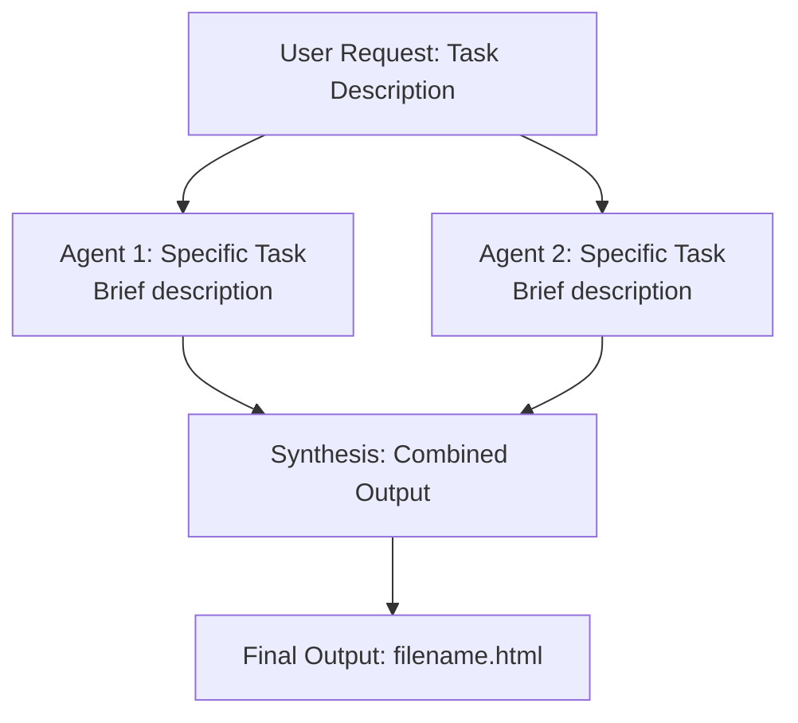

## Purpose

Visualize subagent task dependencies using ASCII diagrams before launching agents, and create comprehensive HTML visualizations after completion.

## Priority Instruction: ASCII Diagram FIRST

**CRITICAL:** When launching subagents using the Task tool, draw an ASCII diagram as the FIRST thing in your response, showing the parallel/sequential structure of the agents you are about to launch.

### When to Draw the Diagram

Draw the diagram in BOTH scenarios:
1. **BEFORE launching agents:** Show the planned structure
2. **AFTER agents complete:** Show the completed workflow (for visualization requests)

### ASCII Diagram Format

#### For Parallel Agents (Multiple agents launched simultaneously)

```
┌─────────────────────────────────────────────────────────────┐
│                      USER REQUEST                           │
│  [Brief description of the overall task]                    │
└─────────────────────────────────────────────────────────────┘
                            │
                ┌───────────┼───────────┐
                │           │           │
                ▼           ▼           ▼
        ┌───────────┐ ┌───────────┐ ┌───────────┐
        │  AGENT 1  │ │  AGENT 2  │ │  AGENT 3  │
        │ [Task A]  │ │ [Task B]  │ │ [Task C]  │
        └───────────┘ └───────────┘ └───────────┘
                │           │           │
                └───────────┼───────────┘
                            ▼
                    ┌───────────────┐
                    │   SYNTHESIS   │
                    │ [Integration] │
                    └───────────────┘
```

#### For Sequential Agents (Agents launched one after another)

```
┌─────────────────────────────────────────────────────────────┐
│                      USER REQUEST                           │
│  [Brief description of the overall task]                    │
└─────────────────────────────────────────────────────────────┘
                            │
                            ▼
                    ┌───────────────┐
                    │    AGENT 1    │
                    │ [First task]  │
                    └───────────────┘
                            │
                            ▼
                    ┌───────────────┐
                    │    AGENT 2    │
                    │ [Second task] │
                    │ (needs Agent  │
                    │  1's output)  │
                    └───────────────┘
                            │
                            ▼
                    ┌───────────────┐
                    │    AGENT 3    │
                    │ [Final task]  │
                    └───────────────┘
```

#### For Mixed Parallel/Sequential

```
┌─────────────────────────────────────────────────────────────┐
│                      USER REQUEST                           │
│  [Verify quotations in essay]                              │
└─────────────────────────────────────────────────────────────┘
                            │
            ┌───────────────┼───────────────┐
            │               │               │
            ▼               ▼               ▼
    ┌───────────┐   ┌───────────┐   ┌───────────┐
    │  AGENT 1  │   │  AGENT 2  │   │  AGENT 3  │
    │ Quote A   │   │ Quote B   │   │ Quote C   │
    │ p. 400    │   │ p. 401    │   │ p. 402    │
    └───────────┘   └───────────┘   └───────────┘
            │               │               │
            └───────────────┼───────────────┘
                            ▼
                    ┌───────────────┐
                    │    AGENT 4    │
                    │ Verify all    │
                    │ are exact     │
                    └───────────────┘
```

### Label Guidelines

**Agent boxes should show:**
- Agent number (AGENT 1, AGENT 2, etc.)
- Concise task description (max 3-4 words)
- Critical parameter if relevant (page number, file name, etc.)

**Example labels:**
- "AGENT 1: Sima Qian p.400"
- "AGENT 2: Su Shi p.679"
- "AGENT 3: Qu Yuan catalog"

### Placement in Response

Your response structure MUST be:

```
[ASCII DIAGRAM FIRST]

[Brief explanation of strategy - 1-2 sentences]

[Tool calls to launch agents]
```

**Example:**

```
I'm launching 3 parallel agents to verify each quotation independently:

┌─────────────────────────────────────────────────────────────┐
│           VERIFY QUOTATIONS IN ESSAY                        │
└─────────────────────────────────────────────────────────────┘
                            │
            ┌───────────────┼───────────────┐
            │               │               │
            ▼               ▼               ▼
    ┌───────────┐   ┌───────────┐   ┌───────────┐
    │  AGENT 1  │   │  AGENT 2  │   │  AGENT 3  │
    │ Mount Tai │   │ Dwelling  │   │ Qu Yuan   │
    │ Quote     │   │ in Filth  │   │ Catalog   │
    │ p. 400    │   │ p. 401    │   │ p. 402    │
    └───────────┘   └───────────┘   └───────────┘

Each agent will extract the single page and verify word-for-word accuracy.

[Task tool call 1]
[Task tool call 2]
[Task tool call 3]
```

### Why This Matters

The ASCII diagram:
1. **Immediately shows structure:** User sees parallel vs sequential at a glance
2. **Clarifies dependencies:** Makes clear which tasks depend on others
3. **Sets expectations:** User knows how many agents and what they're doing
4. **Provides navigation:** Makes it easier to follow when agents report back
5. **Documents approach:** Creates a visual record of the problem-solving strategy

## Full HTML Visualization (Post-Completion)

When the user mentions "subagent(s)" in context of wanting to visualize or summarize what happened, create a comprehensive task dependency graph and workflow visualization.

### What to Create

Generate an interactive HTML file named `claude_agent_workflow_[task_name].html` that includes:

#### 1. Mermaid Dependency Graph

Create a flowchart showing:
- Initial user request as starting node
- Each agent launched as a node with task description
- Dependencies between agents (parallel vs. sequential)
- Synthesis/aggregation step if applicable
- Final output node

Use color coding:
- `:::launched` - Sky blue (#87CEEB) for initial tasks
- `:::running` - Gold (#FFD700) for in-progress
- `:::completed` - Light green (#90EE90) for finished agents
- `:::synthesized` - Plum (#DDA0DD) for synthesis/output

Example structure:


#### 2. Execution Statistics Dashboard

Display key metrics in a grid:
- Number of agents launched
- Number completed successfully
- Success rate percentage
- Execution mode (Parallel/Sequential/Mixed)
- Total tokens used
- Output word count
- Processing time (if available)

#### 3. Task Detail Cards

For each agent, create an expandable card containing:

**Card Header:**
- Status indicator dot (color-coded)
- Agent number and title
- Agent type badge (general-purpose, specialized, etc.)

**Card Content:**
- Clear task description
- Task tags (research, analysis, empirical, etc.)
- Collapsible "Key Findings" section with:
  - Main discoveries
  - Data points found
  - Patterns identified
  - Limitations encountered

**Layout:** Use grid layout with 2-3 columns depending on number of agents

#### 4. Synthesis Process Section

Explain how findings were combined:
- **Execution Strategy:** Why parallel vs sequential
- **Data Integration:** How outputs were merged
- **Cross-Validation:** Where agents reinforced each other
- **Conflict Resolution:** How contradictions were handled
- **Output Generation:** Final format and structure

#### 5. Dependency Analysis

Provide insights on:
- Which tasks were independent (could run in parallel)
- Which had dependencies (required sequential execution)
- Critical path through the workflow
- Bottlenecks or waiting points
- Efficiency gains from parallelization

#### 6. Key Insights Section

Highlight:
- ✓ Strengths of the approach used
- ⚠ Challenges encountered
- 💡 Lessons learned
- 🎯 Recommendations for future similar tasks

## Information to Gather

Before generating, ask the user (or infer from context):

1. **How many agents were launched?**
2. **What was each agent's specific task?**
3. **What agent type was used?** (general-purpose, specialized, etc.)
4. **Were they parallel, sequential, or mixed?**
5. **What were the key findings from each?**
6. **Was there a synthesis step?**
7. **What was the final output?**

If information is missing, make reasonable inferences based on:
- Tool calls visible in conversation history
- Task tool invocations with descriptions
- Agent responses and outputs
- Context of the user's request

## Generation Steps

1. **Analyze Context:** Review recent conversation for Task tool usage
2. **Extract Metadata:** Identify agents, tasks, dependencies, findings
3. **Structure Data:** Organize into visualization components
4. **Generate HTML:** Create complete interactive document
5. **Write File:** Save as `claude_agent_workflow_[descriptive_name].html`
6. **Open in Browser:** Use `open` command (macOS) or appropriate for OS
7. **Confirm to User:** Show filename and summarize what was created

## Example Trigger Phrases

User says:
- "Can you visualize the subagents you launched?"
- "Show me a dependency graph of the subagent tasks"
- "Summarize what the subagents found"
- "Create a workflow diagram for those agents"
- "I want to see how the subagents worked together"

## Quality Checklist

Before generating, ensure:
- ✓ All agents are represented in the graph
- ✓ Dependencies are accurately shown
- ✓ Status colors are correct
- ✓ Key findings are summarized (not just copied)
- ✓ Statistics are calculated correctly
- ✓ Interactive features work (collapsibles, hover states)
- ✓ Mermaid syntax is valid
- ✓ File is saved and opened successfully
- ✓ User is informed about what was created

## Notes

- This visualization is most useful AFTER agents have completed
- If agents are still running, show "in progress" status
- Can be regenerated/updated as more agents complete
- Helpful for understanding complex multi-agent workflows
- Serves as documentation of the analysis process
- Can be shared with others to explain methodology
