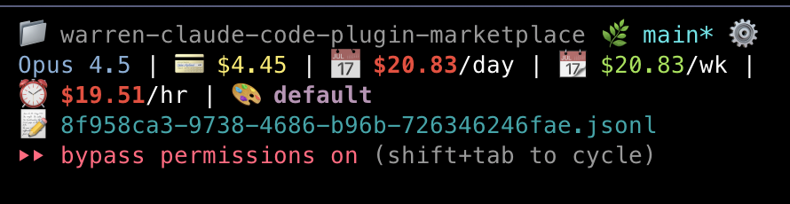

# Spending Tracker Plugin

Track your Claude Code API spending with daily and hourly breakdowns. This plugin provides slash commands to view statistics and manage your spending data.



*Example: Statusline showing session cost ($4.45), daily ($20.83/day), weekly ($20.83/wk), and hourly ($19.51/hr) spending*

## ⚠️ Important: Statusline Integration Required

This plugin requires manual integration with your Claude Code statusline for automatic tracking. The plugin provides a Python script that you call from your statusline—no automatic hooks or helper scripts.

**Why?** Claude Code exposes cost data only through the statusline JSON input. Manual integration is safer and gives you full control over your statusline.

**Data Storage:** All spending data is stored in `~/.claude/plugins/spending-tracker/spending_data/` (within the plugin directory).

## Features

- Track API spending per day and per hour
- View detailed statistics with averages
- Session-based delta tracking (only counts new spending)
- Thread-safe file operations with locking
- Automatic cleanup of old data (30-day retention)
- Manual statusline integration (copy/paste code)

## Installation

### From Marketplace

1. Add the marketplace:
   ```bash
   /plugin marketplace add warren-claude-code-plugin-marketplace
   ```

2. Install the plugin:
   ```bash
   /plugin install spending-tracker@warren-claude-code-plugin-marketplace
   ```

3. Restart Claude Code

### Manual Installation

1. Clone this repository
2. Copy the `spending-tracker-plugin` directory to `~/.claude/plugins/`
3. Restart Claude Code

## Available Commands

### `/spending-get`

Get current spending totals for today and the current hour.

```bash
/spending-get
```

Example output:
```
Daily: $5.25
Hourly: $1.32
```

### `/spending-stats`

Display detailed spending statistics including historical data and averages.

```bash
/spending-stats
```

Example output:
```
=== Spending Statistics ===

Daily Tracking:
  Total days tracked: 15
  Total across all days: $123.45
  Average per day: $8.23

Hourly Tracking:
  Total hours tracked: 89
  Total across all hours: $123.45
  Average per hour: $1.39

Current Period:
  Today (2025-10-10): $12.34
  This hour (2025-10-10T12:00): $2.45
```

### `/spending-reset`

Reset all spending tracking data. This operation is destructive and requires confirmation.

```bash
/spending-reset              # Will ask for confirmation
/spending-reset --confirm    # Skip confirmation
/spending-reset -f           # Skip confirmation (short flag)
```

## Manual Statusline Integration

You need to manually add tracking code to your statusline script. This approach is safer than auto-sourcing scripts and gives you full control.

### Step 1: Locate Your Statusline Script

Your statusline script is defined in `~/.claude/settings.json`:

```json
{
  "statusLine": {
    "type": "command",
    "command": "bash ~/.claude/statusline-command.sh"
  }
}
```

### Step 2: Add Tracking Code

Add this code to your statusline script where you have access to `$cost_raw` and `$transcript_path` variables:

```bash
# ============================================================================
# SPENDING TRACKER INTEGRATION
# ============================================================================
# Track spending using plugin (data stored in plugin directory)
if [ -n "$cost_raw" ] && [ "$cost_raw" != "null" ]; then
    cost_dollars=$(echo "$cost_raw" | awk '{printf "%.8f", $1}')

    if (($(echo "$cost_dollars > 0" | bc -l))); then
        # Extract session ID from transcript path
        session_id="unknown"
        if [ -n "$transcript_path" ] && [ "$transcript_path" != "null" ]; then
            transcript_name=$(basename "$transcript_path")
            session_id="${transcript_name%.jsonl}"
        fi

        # Call plugin script with --data-dir pointing to plugin directory
        PLUGIN_DATA_DIR="$HOME/.claude/plugins/spending-tracker/spending_data"
        python3 ~/.claude/plugins/spending-tracker/scripts/track_spending.py \
            add-session \
            --data-dir "$PLUGIN_DATA_DIR" \
            --session-id "$session_id" \
            --cost "$cost_dollars" \
            2>/dev/null >/dev/null
    fi
fi
```

### Step 3 (Optional): Display Spending Totals

If you want to show spending in your statusline, add this code:

```bash
# Get spending totals for display
PLUGIN_DATA_DIR="$HOME/.claude/plugins/spending-tracker/spending_data"
totals_json=$(python3 ~/.claude/plugins/spending-tracker/scripts/track_spending.py \
    get \
    --data-dir "$PLUGIN_DATA_DIR" \
    --format json \
    2>/dev/null || echo '{}')

daily_total=$(echo "$totals_json" | jq -r '.daily_total // 0')
hourly_total=$(echo "$totals_json" | jq -r '.hourly_total // 0')

# Display however you like
if [ "$daily_total" != "0" ]; then
    printf "💰 Today: $%.2f" "$daily_total"
fi
```

### Complete Example

See `examples/statusline-command-example.sh` for a complete working statusline with tracking integrated

## Data Storage

Spending data is stored in `~/.claude/plugins/spending-tracker/spending_data/`:

- `daily.json` - Daily spending totals
- `hourly.json` - Hourly spending totals
- `session_state.json` - Session tracking for delta calculations
- `.lock` files - Thread-safe file locking

**Note:** Data is stored within the plugin directory for easy management. Uninstalling the plugin will remove all data.

## Configuration

### Data Directory

The script accepts a `--data-dir` argument to specify where to store data. This defaults to the plugin directory when called from the statusline integration code.

You can also override via environment variable:
```bash
export SPENDING_TRACKER_DATA_DIR="$HOME/my-custom-location"
```

### Other Settings

Edit `scripts/track_spending.py` for these options:

```python
CONFIG = {
    "retention_days": 30,          # Keep data for 30 days
    "lock_timeout": 5,             # Max 5 seconds to acquire lock
    "decimal_places": 8,           # Precision for cost tracking
    "enable_cleanup": True,        # Auto-cleanup old data
}
```

## How It Works

### Session-Based Delta Tracking

The tracker uses session-based delta tracking to avoid double-counting:

1. Each Claude Code session has a unique session ID
2. The tracker remembers the last known cost for each session
3. Only the delta (new spending) is added to daily/hourly totals
4. This prevents re-adding the same cost on multiple statusline updates

### Example Flow

```
Session starts: $0.00 → Track: $0.00 (delta: $0.00)
After message 1: $0.05 → Track: $0.05 (delta: $0.05)
After message 2: $0.12 → Track: $0.12 (delta: $0.07)
After message 3: $0.20 → Track: $0.20 (delta: $0.08)
Total tracked: $0.20 ✓
```

## CLI Usage

The underlying Python script can also be used directly:

```bash
# Set data directory for plugin
PLUGIN_DATA_DIR="$HOME/.claude/plugins/spending-tracker/spending_data"

# Add cost with session tracking (recommended)
python3 ~/.claude/plugins/spending-tracker/scripts/track_spending.py \
  add-session \
  --data-dir "$PLUGIN_DATA_DIR" \
  --session-id "unique-session-id" \
  --cost 5.25

# Get totals (JSON format)
python3 ~/.claude/plugins/spending-tracker/scripts/track_spending.py \
  get \
  --data-dir "$PLUGIN_DATA_DIR" \
  --format json

# Get totals (text format)
python3 ~/.claude/plugins/spending-tracker/scripts/track_spending.py \
  get \
  --data-dir "$PLUGIN_DATA_DIR" \
  --format text

# Show statistics
python3 ~/.claude/plugins/spending-tracker/scripts/track_spending.py \
  stats \
  --data-dir "$PLUGIN_DATA_DIR"

# Reset all data (requires --confirm)
python3 ~/.claude/plugins/spending-tracker/scripts/track_spending.py \
  reset \
  --data-dir "$PLUGIN_DATA_DIR" \
  --confirm
```

## Troubleshooting

**Commands not appearing:**
- Run `/help` to verify installation
- Check that plugin is enabled in settings
- Restart Claude Code

**Data not tracking:**
- Verify statusline integration code is added correctly
- Check data directory gets created: `~/.claude/plugins/spending-tracker/spending_data/`
- Test manually: Run `/spending-stats` after a conversation
- Check file permissions

**Reset not working:**
- Always requires `--confirm` flag for safety
- Use `/spending-reset --confirm` to bypass confirmation prompt

## License

MIT License - Feel free to use and modify as needed.

## Author

Fucheng Warren Zhu (wzhu@college.harvard.edu)

## Contributing

Contributions welcome! Please submit issues and pull requests to the marketplace repository.

---

**Last Updated:** 2025-11-25
